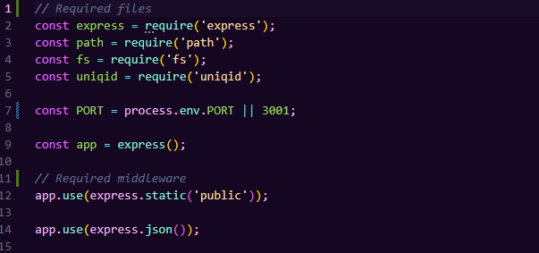
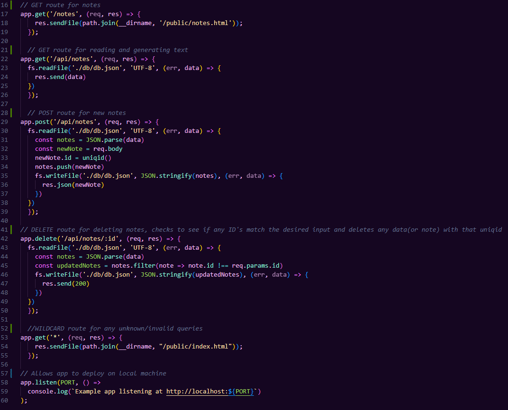

# note-taker 

## Description
note-taker is an aptly-named application that allows users to jot down notes, save them for later, or delete them when they're no longer needed.

## Table of Contents
1. [Installation](#installation)
2. [Usage](#usage)
3. [License](#license)
4. [Contributing](#contributing)
5. [Tests](#tests)
6. [Questions](#questions)

## Installation
Project is installed using Github and Node.

## Usage
Users can write down notes and title them. The notes are saved on the left side of the screen and persist. When the user is finished with note, they can delete them using a delete button.

The following screenshot displays the code that brings in all required files/packages. 

The following code is responsible for all routing/pathing in the application. It includes a wildcard route that redirects users back to the index/homepage.

## License
MIT

## Contributing
Users can contribute through Github branching.

## Tests
N/A

## Questions
derekjmedrano@gmail.com
[Github](www.github.com/derekmedrano)
